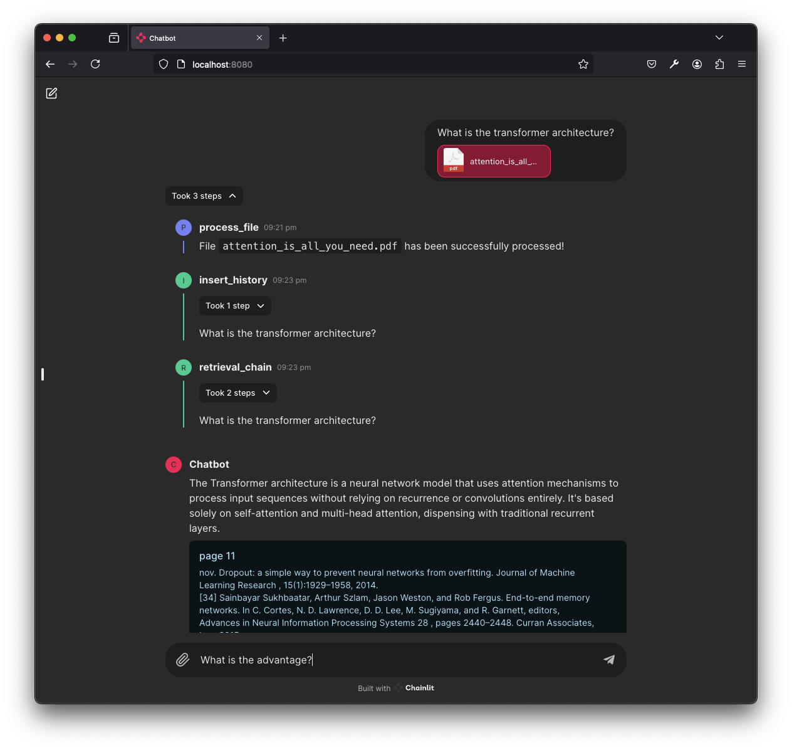

# ChatDocs 🤖📚

A chatbot, utilizing private Large Language Models (LLMs), designed for question-answering on private documents,
available through a web app.

## Features

* Utilizes Containerization
* Private Models
* Conversational Awareness
* PDF File Support

## Quick Start

Simply execute `make up` to initiate the different components including Large Language Models (LLMs), Embeddings, Vector
database, and the web application. After setup, start the web app with `make chainlit` within the `chat_docs_dev`
container, and access it at [http://localhost:8080](http://localhost:8080)

## Tests

To perform type checks and lint the project's source code, simply run `make test`.
